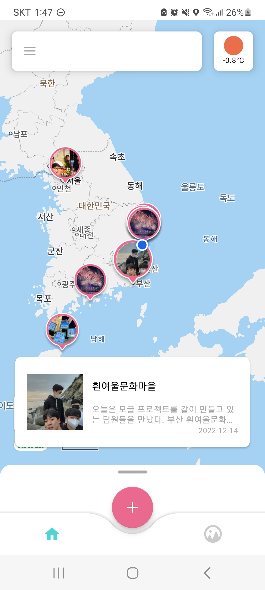
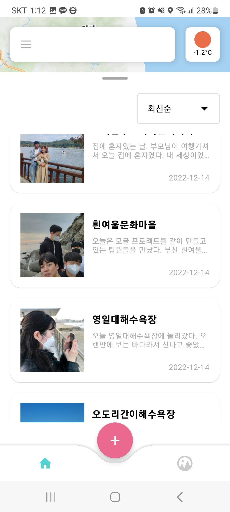
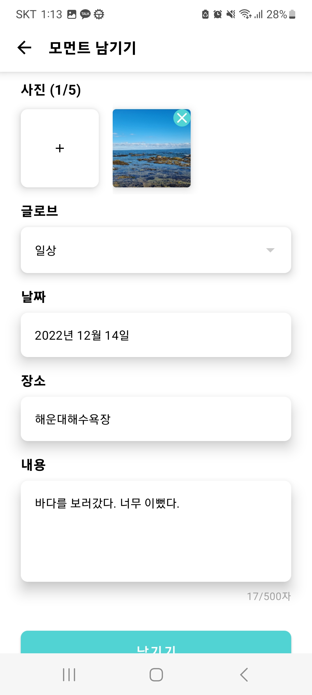
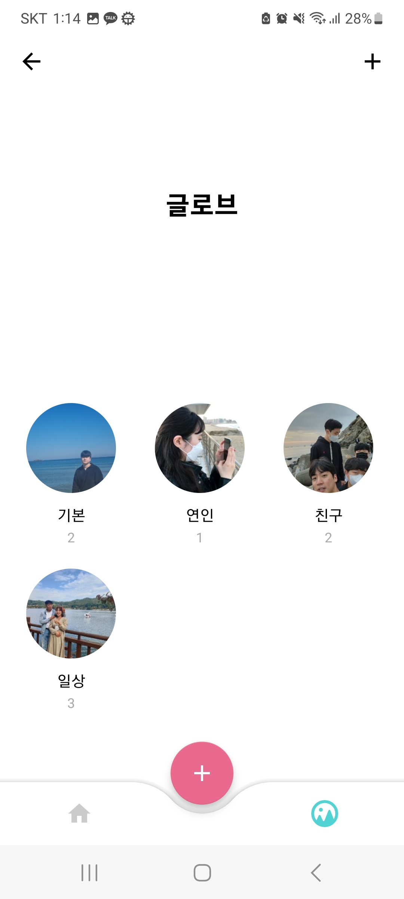
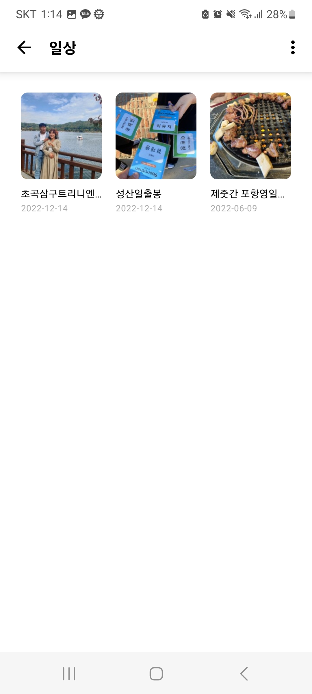
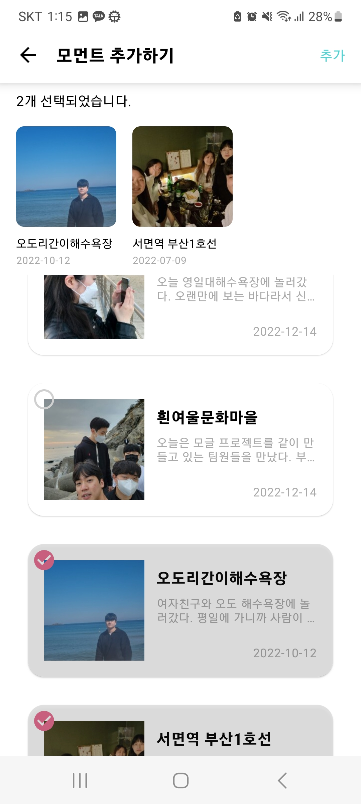
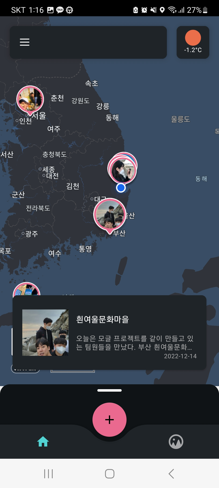
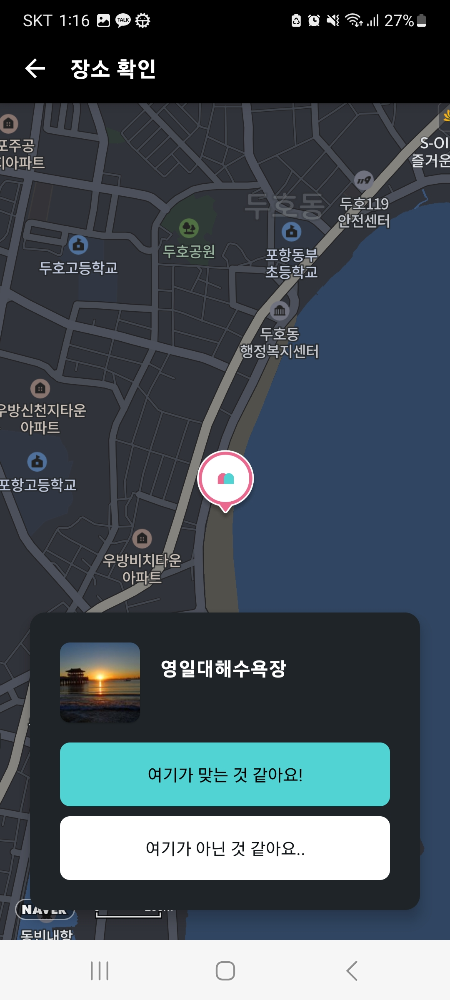
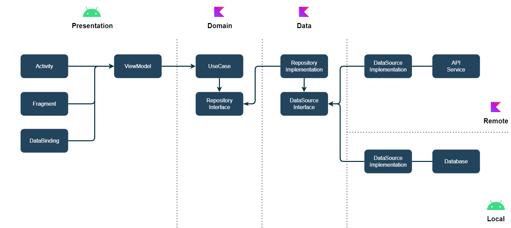

    
  <b>지도에 위에 작성하는 나만의 감성 다이어리 ✏</b>  
    

  부스트캠프 7기 그룹 프로젝트  

## 팀원 소개
팀명: `자고 일어났더니 내가 iOS 개발자?!`

| [K007 김범규](https://github.com/BBongKim) |                                     [K029 유재민](https://github.com/jaemin-Yoo)                                      | [K044 장희직](https://github.com/jhg3410) | [K057 최지환](https://github.com/Choe-Ji-Hwan) |
|:-------------------------:|:------------------------------------------------------------------------------------------------------------------:|:------------------------------------:|:-------------------------------------------:|
||  | |                                    |

  

## 프로젝트 소개
**"지금 이 순간"** 나의 감정을 잊지 않도록 기록해보세요.  
감정을 느낀 장소와 그때 그 날씨를 `모글`이 잊지 않도록 도와줍니다.  
지금 바로 나의 이야기를 기록하고 지도에서 확인해보세요.  
[Google PlayStore](https://play.google.com/store/apps/details?id=com.wakeup.mogle)

 

### 📙 지도에서 볼 수 있는 나의 스토리
> 장소에 대한 나의 이야기를 기록하고 지도에서 확인해봐요.

  

 

### 🔖 다양한 나의 스토리를 그룹으로 관리
> 가족, 친구 등 나의 이야기를 그룹으로 분류해봐요.

  

 

### 🌞 날씨에 따른 테마 변경  
> 날씨에 따라 변경되는 테마로 감성에 젖어보세요.

  

  

## 기술 스택

### Architecture
- Clean Architecture
- Single Activity Architecture
- MVVM

### Jetpack (AAC)
- Data Binding
- ViewModel
- Navigation
- Room
- Paging3 

### Etc
- Hilt 
- Coroutines / Flow
- Retrofit2
- Okhttp3
- Kotlinx-serialization
- Kotlin DSL
- min sdk 23

### CI / CD

### Communication
     

  

## 기술 아티클

- [Custom ViewPager Indicator](https://boostcamp-wm.notion.site/Custom-ViewPager-Indicator-ed2572f42c574908a852254584c00298)  
- [Single Activity Architecture(SAA) 적용기](https://boostcamp-wm.notion.site/Single-Activity-Architecture-SAA-14bf6d886fe04339b7b5ad27cd54d42e)  
- [Custom Dialog](https://boostcamp-wm.notion.site/Custom-Dialog-61fb91ad2a784f3da2b7f7b0f8bd4f96)  
- [이미지 지연 로드 문제 해결하기](https://boostcamp-wm.notion.site/baec3a54a8124361bc085fb511986255)  
- [다양한 이슈 공유](https://scientific-petunia-d2d.notion.site/126b704f0d5c423c98fdd245ba9a2ec8?v=c2f8ffeb7c884812ad7f62ef8f7f8871)
